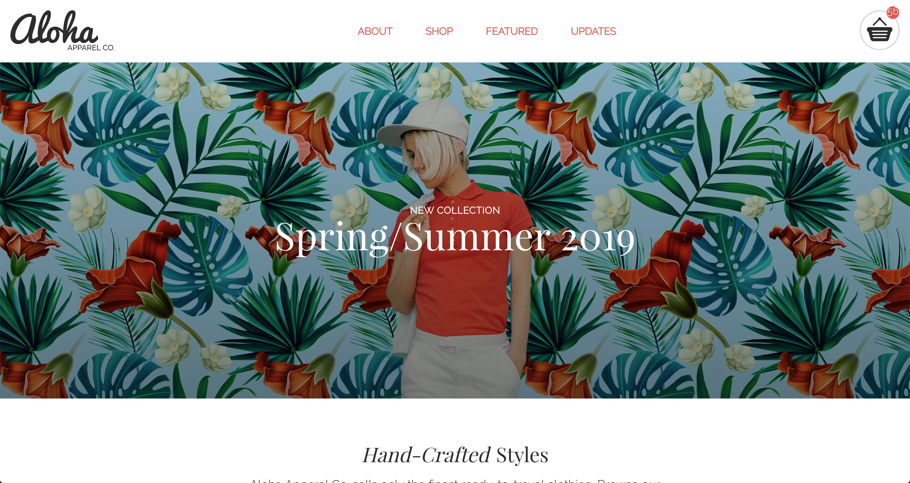

# Aloha Project

Recreation of REDAcademy 1st project.

Must create a replica of Aloha website and must have all design aspect in it.
Must have responsive design, proper coding techinque, and clean code.
HTML, CSS, JAVASCRIPT, AND JQUERY, USED TO RECREATE WEBSITE.

All Stretch goals finished
* ✓ Fixed Nav bar
* ✓ "Add to cart" adds one to the cart.

## Screenshot

## Installation

No installation needed because it is a website.
Just open index file or clone into text editor.

### Personal learning

- Create repsonsive design
- Media Queries
- Proper HTML & CSS
- JQuery
- REMS and EM

#### Meta

Nikki Wu WDP Fall 2018 - nikkiwu9@gmail.com

Finished on October 16/18

Orginial creator of website -@REDAcademy
